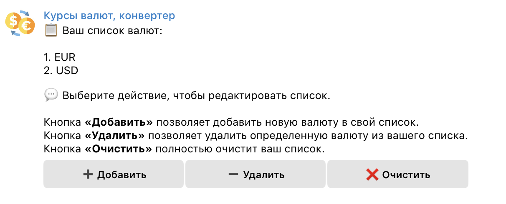
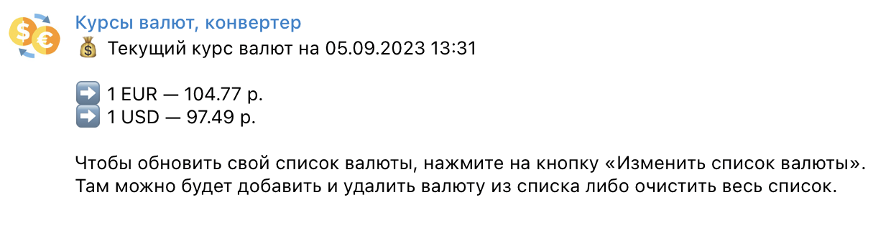
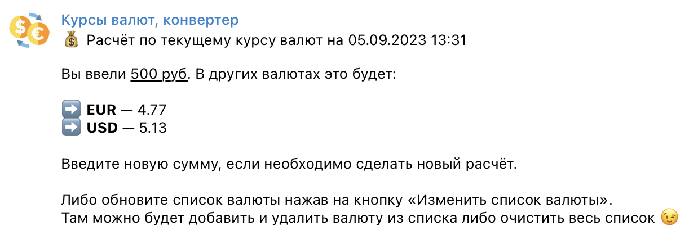
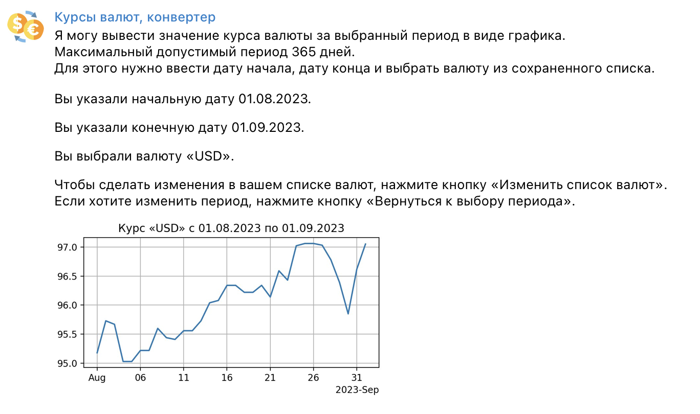
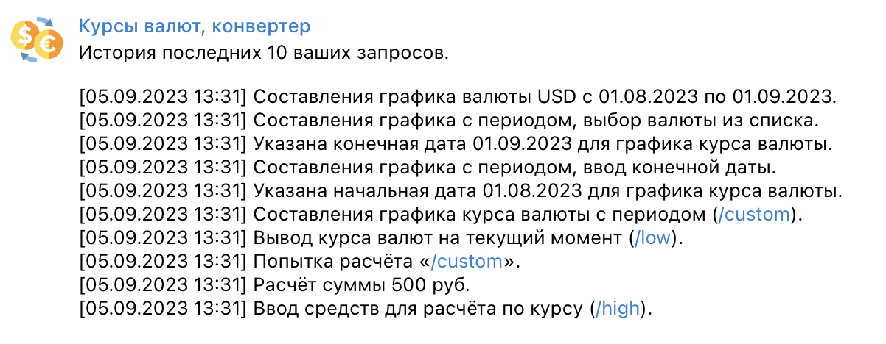

# Телеграм-бот «Курсы валют»
## Содержание
* [Краткое описание](#description)
* [Установка и настройка](#install)
  * [Перед тем, как начать](#install-python)
  * [Клонирование репозитория](#install-git)
  * [Создание бота в телеграм (BotFather)](#install-botfather)
  * [Ключ и хост от API](#install-api)
  * [Файл .env](#install-env)
  * [Запуск бота](#install-start)
* [Команды](#commands)
  * [Команда /start](#command-start)
  * [Команда /help](#command-help)
  * [Команда /currencies](#command-currencies)
  * [Команда /low](#command-low)
  * [Команда /high](#command-high)
  * [Команда /custom](#command-custom)
  * [Команда /history](#command-history)
* [Используемые библиотеки](#utils)

<a name="description"></a>
## Краткое описание
Телеграм-бот «Курсы валют» позволяет составить список валют, 
узнать актуальные курсы валют либо составить график курса валюты указанного периода.\
Пользователь с помощью специальных команд бота может выполнить следующие действия:
* Запустить бота (**команда /start**)
* Обратиться к справке по командам (**команда /help**)
* Сделать изменения в своем списке валют (**команда /currencies**)
* Узнать курс валют на текущий момент (**команда /low**)
* Рассчитать свои средства по текущему курсу валют (**команда /high**)
* Составить график курса валюты за период в виде картинки (**команда /custom**)
* Посмотреть историю запросов (**команда /history**)

Телеграм-бот составлен на основе библиотеки [pyTelegramBotAPI](https://github.com/eternnoir/pyTelegramBotAPI "Переход к библмотеке pyTelegramBotAPI")

Для разработки и функционирования использовался открытый API Currency Conversion, 
который расположен на сайте [rapidapi.com](https://rapidapi.com "Переход на сайт rapidapi.com").

<a name="install"></a>
## Установка и настройка
Эти инструкции помогут развернуть проект на локальном компьютере для использования.

<a name="install-python"></a>
### Перед тем, как начать
* Проверьте, что у вас установлен `Python` и есть виртуальное пространство

<a name="install-git"></a>
### Клонирование репозитория
* Перейдите в папку проекта и выполните команду `git clone`, чтобы скопировать файлы репозитория
```
git clone https://gitlab.skillbox.ru/artem_karmanov/python_basic_diploma.git
```

<a name="install-botfather"></a>
### Создание бота в телеграм (BotFather)
* Найдите бота BotFather в телеграм и создайте нового бота командой `/newbot`
* Следуя инструкции, укажите название и username бота. Скопируйте отправленный вам токен бота.

<a name="install-api"></a>
### Ключ и хост от API
* Получите ключ и хост с [API Currency Conversion and Exchange Rates](https://rapidapi.com/principalapis/api/currency-conversion-and-exchange-rates "Переход к API") на сайте [rapidapi.com](https://rpidapi.com "Переход на сайт rapidapi.com")

<a name="install-env"></a>
### Файл .env
* Скопируйте файл `.env.template` или его содержимое и сохраните под именем нового файла `.env`
* Укажите все полученные данные в файле `.env` в ковычках
  * Токен созданного бота в BotFather в переменной **BOT_TOKEN**
  * Ключ от API в переменной **RAPID_API_KEY**
  * Хост от API в переменной **RAPID_API_HOST**

```
BOT_TOKEN = "Ваш токен для бота, полученный от @BotFather"
RAPID_API_KEY = "Ваш ключ полученный от API"
RAPID_API_HOST = "Ваш хост полученный от API"
```
<a name="install-start"></a>
### Запуск бота
* Запустите файл main.py в папке проекта

<a name="commands"></a>
## Команды

<a name="command-start"></a>
### Команда /start
Создается сущность в БД, если ранее пользователь не был зарегистрирован и 
добавляются по умолчанию 2 валюты (USD, EUR) в список валют пользователя.

Функционал:
1. Выводится приветствие пользователя

<a name="command-help"></a>
### Команда /help
Список команд для работы с ботом

Функционал:
1. Выводится весь список команд работающие с ботом

<a name="command-currencies"></a>
### Команда /currencies
Выводит список валют пользователя с возможностью редактирования. 
Максимальное кол-во валют в списке — 5.

Функционал:
1. Выводится список сохраненных валют
2. Кнопка **«Добавить»** выводит весь список валют с API, которые возможно добавить пользователю.\
После запрашивает ввод пользователя, какую валюту добавить.
3. Кнопка **«Удалить»** выводит inline кнопки добавленных валют.\
При нажатии на валюту, она удаляется из списка пользователя.
4. Кнопка **«Очистить»** запрашивает у пользователя подтверждение на очистку всего списка.\
При подтверждении очищается весь список, либо отменяется запрос.



<a name="command-low"></a>
### Команда /low
Выводит текущие курсы валют.

Функционал:
1. Выводится список сохраненных валют пользователя.
2. Показывает курс по соотношению 1 единицы валюты к рублям на текущий момент



<a name="command-high"></a>
### Команда /high
Калькуляция средств по текущему курсу валют.

Функционал:
1. Запрашивает ввод суммы, которую необходимо рассчитать по курсу валют
2. Выводит список валют пользователя
3. Рассчитывает курсы валют с введенной суммы пользователем



<a name="command-custom"></a>
### Команда /custom
Формирование графика курса валюты за период в виде картинки.

Функционал:
1. Запрашивает начальную дату с помощью календаря
2. Запрашивает конечную дату с помощью календаря, 
3. Выводит список валют пользователя в виде кнопок, чтобы выбрать определенную валюту
4. Формирует график курса указанной валюты в виде картинки за указанный период



<a name="command-history"></a>
### Команда /history
История запросов пользователя.

Функционал:
1. Выводит 10 последних совершенных действий пользователя.



<a name="utils"></a>
## Используемые библиотеки
pyTelegramBotAPI==4.9.0\
python-dotenv==0.21.1\
peewee==3.16.2\
requests~=2.31.0\
matplotlib==3.7.2\
telebot-calendar==1.2